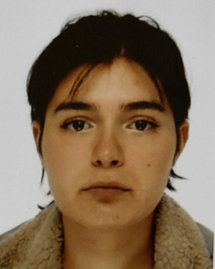

​                                                                                                                                                            
 

# **Léa LE BRUN**

**Étudiante en sciences du langage – Humanités numériques**

📍 Villiers-sur-Orge, France  
📧 le_brunl@outlook.com  
🔗 [Mon GitHub](https://github.com/lealebrun1)  
📞 07 83 10 63 07  

---

## 🎯 À propos de moi

Étudiante en première année de **Sciences du langage** avec une mineure en **Humanités numériques**, je suis à la fois curieuse et rigoureuse. Mon projet professionnel est de devenir **professeure des écoles** ou **enseignante de français au collège**, en France ou à l’étranger.  
Je suis convaincue que les Humanités numériques peuvent enrichir mon parcours : à une époque où le numérique prend une place croissante dans notre quotidien, il me semble essentiel de savoir mobiliser des outils informatiques dans le domaine de l’éducation.

---

## 🎓 Formation

- **Licence Sciences du langage** – _Université Sorbonne Nouvelle_  
  _Mineure Humanités Numériques_  
  2024 – en cours

- **BTS Comptabilité - Gestion** – _ISCG Paris_  
  _En alternance dans une entreprise de gestion de copropriétés_  
  2021 – 2023

---

## 💼 Expériences professionnelles

- **Assistante comptable (alternance)** – _Dauphine Gestion (2021)_  
  - Saisie des factures  
  - Reprise des bilans  
  - Suivi des budgets des copropriétés

- **Responsable de salle** – _Del Arte (2023)_  
  - Service en salle dans un cadre dynamique  
  - Prise de commande, relation client, gestion d’équipe  
  - Formation de nouveaux collègues

---

## 🧠 Compétences

- **Informatique** : Markdown, Git, GitHub, Typora, Pack Office, Excel.. 
- **Langues** : Français (natif), Anglais (niveau B2), Espagnol (niveau A2)..  
- **Qualités** : Autonomie, rigueur, créativité, bon relationnel, aisance à l'oral..

---

## 🎨 Centres d’intérêt

- Jeux vidéo  
- Théâtre  
- Chant  
- Peinture
